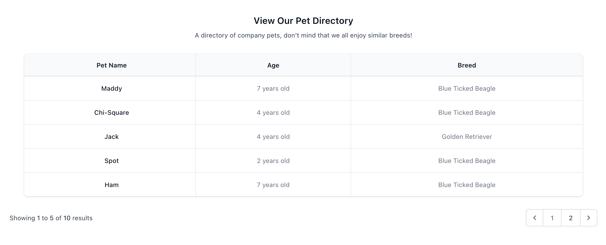
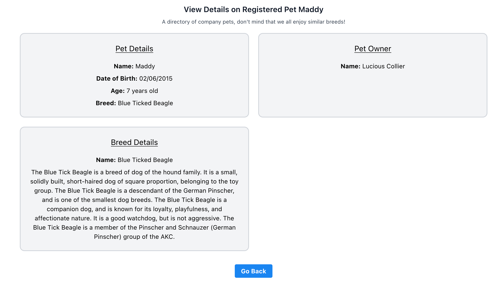

# Registered Pet Directory - Coding Challenge

Completed in September 2022.

### Index Page


### Pet Details Page


## Credits and Tech Used
- Laravel 9.1 - https://laravel.com/
- LiveWire - https://laravel-livewire.com/
- Tailwind CSS - https://tailwindcss.com/
- TailwindUI - https://tailwindui.com/
- Pest - https://pestphp.com/
- MySQL - https://www.mysql.com/

## Instructions
- Clone the repo
- Run `composer install`
- Run `npm install`
- In a separate terminal, use command `npm run dev`
- Create a database and update the `.env` file
- Run `php artisan migrate`
- Run `php artisan db:seed`
- Run `php artisan serve`

You should now be able to visit the webpage at the URL provided by the `php artisan serve` command.

## Run Tests to Check for Webpage Errors

A few tests were written just to ensure the webpages load with a 200 status code

```bash
./vendor/bin/pest
```
